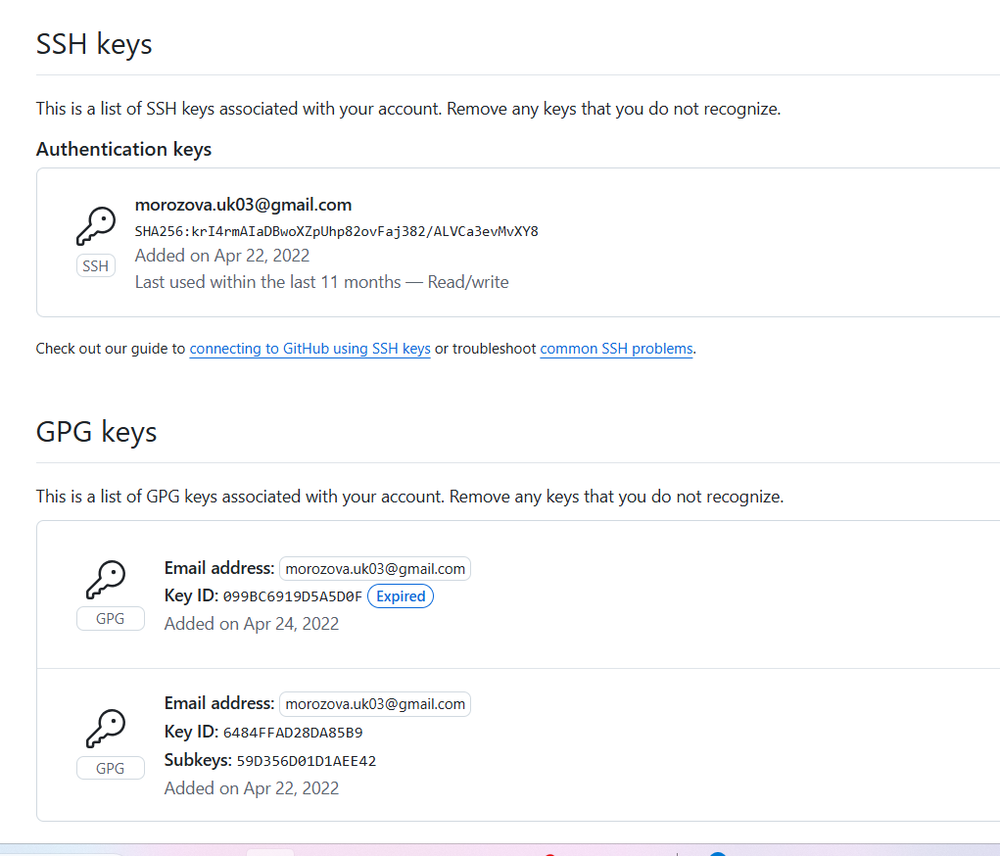
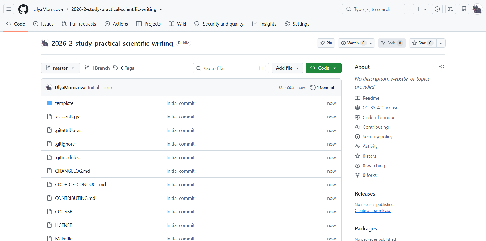
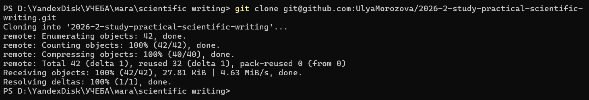

---
## Front matter
lang: ru-RU
title: Лабораторная работа №1
author:
  - Морозова Ульяна
institute:
  - Российский университет дружбы народов, Москва, Россия

date: 01 января 1970

## i18n babel
babel-lang: russian
babel-otherlangs: english

## Formatting pdf
toc: false
toc-title: Содержание
slide_level: 2
aspectratio: 169
section-titles: true
theme: metropolis
header-includes:
 - \metroset{progressbar=frametitle,sectionpage=progressbar,numbering=fraction}
---

## **Цель работы**

Подготовить рабочее пространство для выполнения лабораторных работ.

## GitHub

У меня уже был подключен github и инициализированы ключи SSH и GPG.

{ #fig:001 }

## Репозиторий 1

Далее я скопировала шаблон учебного репозитория и создала копию у себя.

{ #fig:002 }

## Репозиторий 2

С помощью следующей команды я скопировала репозиторий себе на компьютер.

{ #fig:003 }

## texlive

{ #fig:004 width=70% }

## Выводы

Мы подготовили рабочее пространство для выполнения лабораторных работ.

::: {#refs}
:::