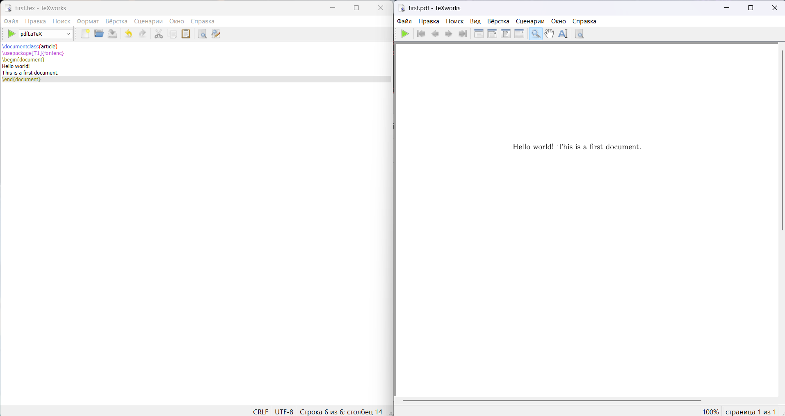

---
## Front matter
lang: ru-RU
title: Лабораторная работа №2
author:
  - Морозова Ульяна
institute:
  - Российский университет дружбы народов, Москва, Россия

date: 24 september 2026

## i18n babel
babel-lang: russian
babel-otherlangs: english

## Formatting pdf
toc: false
toc-title: Содержание
slide_level: 2
aspectratio: 169
section-titles: true
theme: metropolis
header-includes:
 - \metroset{progressbar=frametitle,sectionpage=progressbar,numbering=fraction}
---

## **Цель работы**

Ознакомиться с базовой структурой LaTeX документа.

## Структура LaTeX документа

{ #fig:001 width=70% }

## Изменение кода

{ #fig:001 width=70% }

## Выводы

Мы ознакомились с базовой структурой LaTeX документа.

::: {#refs}
:::