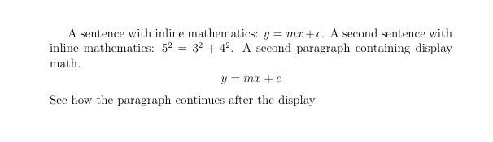
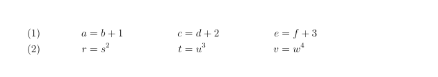
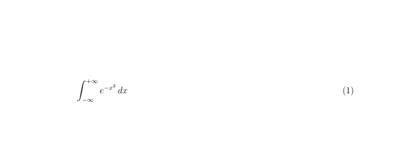

---
## Front matter
lang: ru-RU
title: Лабораторная работа №3
author:
  - Морозова Ульяна
institute:
  - Российский университет дружбы народов, Москва, Россия

date: 8 october 2026

## i18n babel
babel-lang: russian
babel-otherlangs: english

## Formatting pdf
toc: false
toc-title: Содержание
slide_level: 2
aspectratio: 169
section-titles: true
theme: metropolis
header-includes:
 - \metroset{progressbar=frametitle,sectionpage=progressbar,numbering=fraction}
---

## **Цель работы**

Ознакомиться с математическими формулами и функциями языка LaTeX.

## Inline и display стили

В LaTeX математические формулы могут быть представлены двумя способами: inline (встроенные в текст) и display (вынесенные в отдельном абзаце). Для первого способа используем `$...$`, для второго `\[...\]`. 

{ #fig:001 width=50% }
{ #fig:002 width=50% }

## Нумерованные уравнения

Чтобы уравнения нумеровались, запишем его через `\begin{equation} … \end{equation}`

{ #fig:001 width=50% }
{ #fig:001 width=50% }

## Системы уравнений

Для работы с многострочными уравнениями или системами, используем функцию `\begin{align} … \end{align}`, предварительно установив пакет `\usepackage{amsmath}`

{ #fig:001 width=70% }

## Изменение положение номера

Чтобы поменять отображение номеров формулы с левого края на правый, воспользуемся типом документа `\documentclass[leqno]`.

{ #fig:001 width=70% }

## Центрирование формул

Чтобы поменять центрирование формул, воспользуемся типом документа `\documentclass[fleqn]`.

{ #fig:001 width=70% }

## Выводы

Мы ознакомились с некоторыми математическими особенностями LaTeX.

::: {#refs}
:::