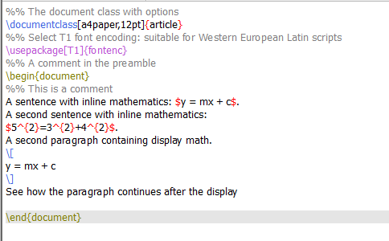
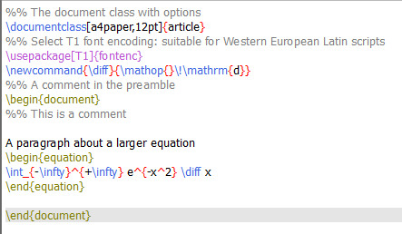
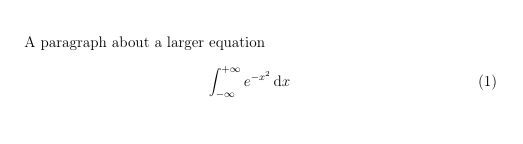
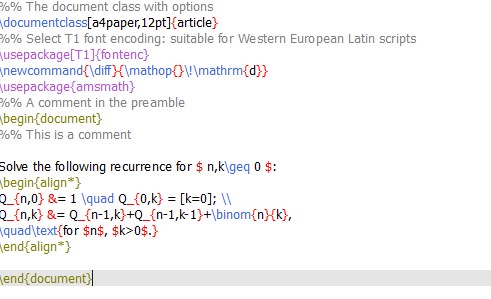
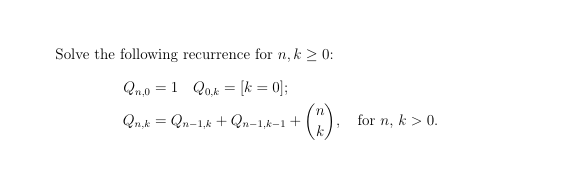
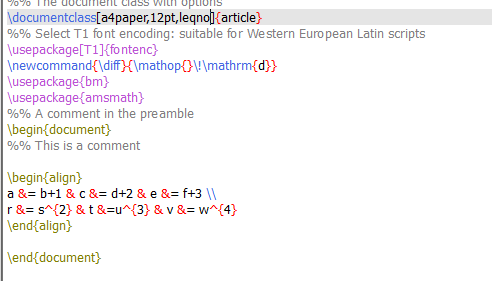
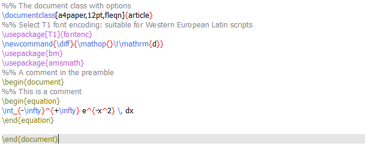

---
## Front matter
title: "Отчет по лабораторной работе №3"
subtitle: "*дисциплина: Computer Skills for Scientific Writing*"
author: "Морозова Ульяна"

## Generic otions
lang: ru-RU
toc-title: "Содержание"

## Bibliography
bibliography: bib/cite.bib
csl: pandoc/csl/gost-r-7-0-5-2008-numeric.csl

## Pdf output format
toc: true # Table of contents
toc-depth: 2
lof: false # List of figures
lot: false # List of tables
fontsize: 12pt
linestretch: 1.5
papersize: a4
documentclass: scrreprt
## I18n polyglossia
polyglossia-lang:
  name: russian
  options:
	- spelling=modern
	- babelshorthands=true
polyglossia-otherlangs:
  name: english
## I18n babel
babel-lang: russian
babel-otherlangs: english
## Fonts
mainfont: IBM Plex Serif
romanfont: IBM Plex Serif
sansfont: IBM Plex Sans
monofont: IBM Plex Mono
mathfont: STIX Two Math
mainfontoptions: Ligatures=Common,Ligatures=TeX,Scale=0.94
romanfontoptions: Ligatures=Common,Ligatures=TeX,Scale=0.94
sansfontoptions: Ligatures=Common,Ligatures=TeX,Scale=MatchLowercase,Scale=0.94
monofontoptions: Scale=MatchLowercase,Scale=0.94,FakeStretch=0.9
mathfontoptions:
## Biblatex
biblatex: true
biblio-style: "gost-numeric"
biblatexoptions:
  - parentracker=true
  - backend=biber
  - hyperref=auto
  - language=auto
  - autolang=other*
  - citestyle=gost-numeric
## Pandoc-crossref LaTeX customization
figureTitle: "Рис."
tableTitle: "Таблица"
listingTitle: "Листинг"
lofTitle: "Список иллюстраций"
lotTitle: "Список таблиц"
lolTitle: "Листинги"
## Misc options
indent: true
header-includes:
  - \usepackage{indentfirst}
  - \usepackage{float} # keep figures where there are in the text
  - \floatplacement{figure}{H} # keep figures where there are in the text
---

# **Цель работы**

Ознакомиться с математическими формулами и функциями языка LaTeX.

# Выполнение лабораторной работы

Для дальнейшей работы создаем файл first.tex в рабочей директории и открываем его в TeXLive.

В LaTeX математические формулы могут быть представлены двумя способами: inline (встроенные в текст) и display (вынесенные в отдельном абзаце). Для первого способа используем `$...$`, для второго `\[...\]`. 

{ #fig:001 width=70% }

{ #fig:002 width=70% }

Также в LaTeX можно вводить различные функции, такие как `\int` - интеграл. Чтобы уравнения нумеровались, запишем его через 
```
\begin{equation} … \end{equation}
```
{ #fig:001 width=70% }

{ #fig:001 width=70% }

Для работы с многострочными уравнениями или системами, используем функцию `\begin{align} … \end{align}`, предварительно установив пакет `\usepackage{amsmath}`

{ #fig:001 width=70% }

{ #fig:001 width=70% }

Чтобы поменять отображение номеров формулы с левого края на правый, воспользуемся типом документа `\documentclass[leqno]`.

{ #fig:001 width=70% }

{ #fig:001 width=70% }

Чтобы поменять центрирование формул, воспользуемся типом документа `\documentclass[fleqn]`.

{ #fig:001 width=70% }

{ #fig:001 width=70% }

# Выводы

Мы ознакомились с некоторыми математическими особенностями LaTeX.

::: {#refs}
:::